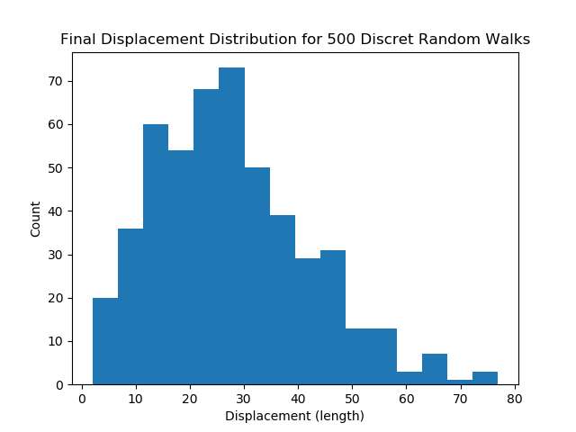

# Discrete Random Walks
In the repo, I cover my analysis of a few different computational results of discrete random walks in 2D and 3D.

## 2D Discrete Random Walk
For a 2D Discrete random walk, I kept track of a variable for the x and y axes. Using numpy random, a direction was chosen from +x,-x,+y,-y. Meaning the path was allowed to overlap. The goal was to find the diffusion constant D using the following equation <x2> = qiDt taken from <a href=http://www.life.illinois.edu/crofts/bioph354/diffusion1.html>HERE<a>. 
<ul>
  <li> <textarea><x^2></textarea> is the mean-square displacement and x is the displacement from starting point.</li>
  <li>qi - numerical constant which depends on dimensionality: qi = 2, 4, or 6, for 1, 2, or 3 dimensional diffusion.</li>
  <li>D - diffusion coefficient (usual units are cm2 s-1 but in this case, the length unit is arbitrary).</li>
  <li>t - time</li>
</ul>
### Random walk with 1000 steps

### Diffusion distribution from 500 independent walks

Mean value of Diffusion coefficent is 0.117 lengths2 s-1  
StDev value of Diffusion coefficent is 0.088 lengths2 s-1 

### Final displacement distribution from 500 independent walks

Mean value of final displacement is 27.674 lengths  
StDev value of final displacement is 14.337 lengths
